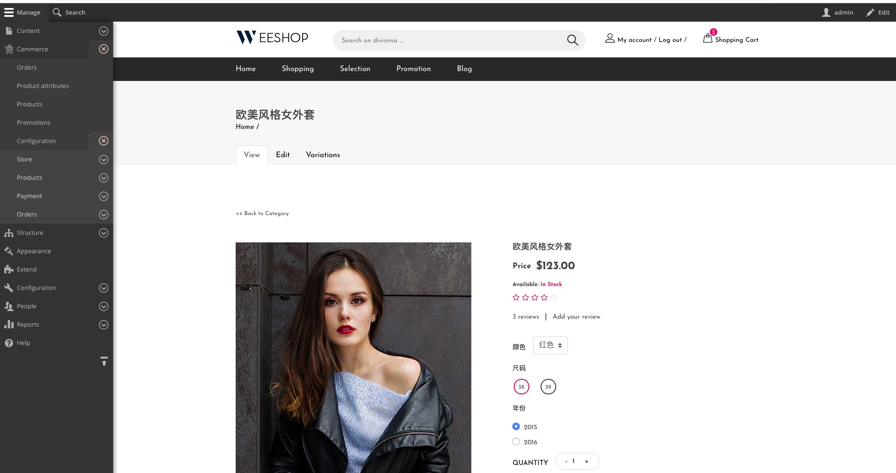
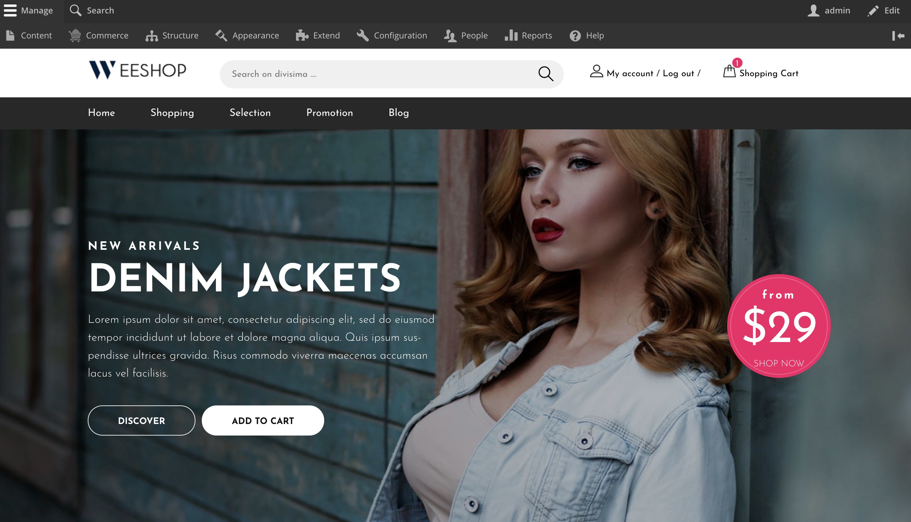
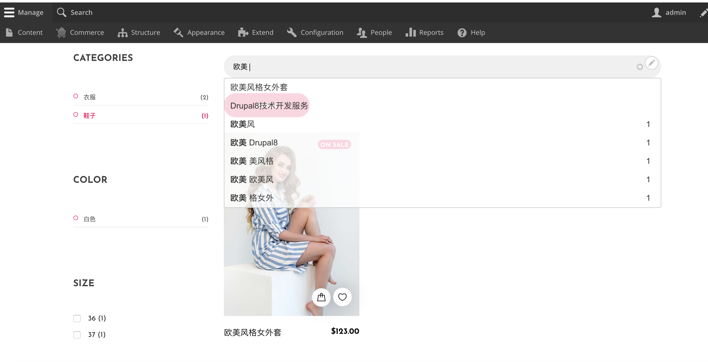

优雅易用的开源商城，支持多货币，多语言，包含 [移动端以及微信小程序](https://github.com/weeshop/WeeApp)
基于 GPL-2.0 开源协议发布，真开源，这是属于中国开源社区的商城。
基于 Laravel 的基因，来自 Symfony 的底层技术，来自 Drupal Commerce 的核心技术，由 Drupal 中国开源社区维护。

## 加入 WeeShop 社区
QQ群：714023327

感谢您的关注，WeeShop的成功离不开您的意见和支持：
- 马上Star此项目，最好同时Fork此项目，以帮助让更多的人看到此项目。
- 我们万分欢迎您参与开发，我们的组织在 [github.com/weeshop](https://github.com/weeshop)。 
- 我们希望听见您的心声，请 [创建issue](https://github.com/weeshop/WeeShop/issues/new) 来表达您的意见。

## 界面截图

简洁的美观的 UI 界面：

支持使用 `Apache Solr` 集群对商品进行`全文检索`，支持使用属性进行`分面搜索`，支持对搜索结果进行预提示：

工程 [WeeShop/WeeShop](https://github.com/weeshop/weeshop) 后台与服务端，微信小程序端的工程在 [WeeShop/WeeApp](https://github.com/weeshop/WeeApp)。

## 特性
- 灵活的商品属性系统，可表达任意类型的商品，包括虚拟商品。
- 支持多仓库存管理，也支持不需要库存管理的商品。
- 灵活的结账过程，可以针对任意商品类型定制结账过程。
- 支持全球的物流信息对接，支持国内各大快递公司。
- 完备的多语言系统，支持全球100多种语言。
- 支持全球流行的各种支付手段，Paypal、支付宝、微信、银行卡等。
- 使用全文检索技术，可以选择使用各种流行的全文检索方案，如Apache solr等。
- 支持符合工业标准的RESTful接口，可配置多种认证方式HTTP Basic、Oauth2.0 等，轻松进行移动应用开发。

#### 重要Issuse 
- Docker for windows, volume默认权限是755，而无法更改 [#issues39](https://github.com/docker/for-win/issues/39)
  
  - 解决办法，使用Mac或Linux系统
  - 在 `docker-compose.yml` 中把 `/app/web/sites` 目录的volume注掉，让文件留在容器内